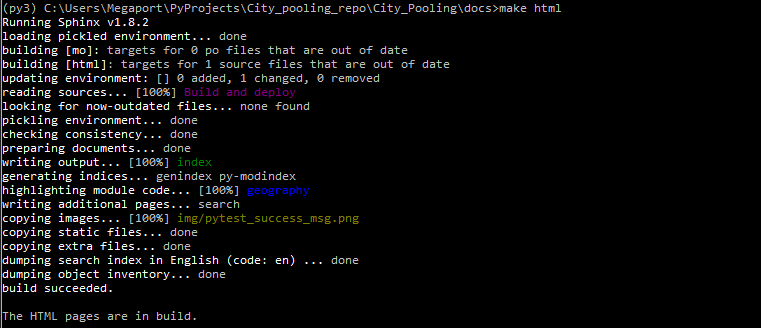

################
Build and Deploy
################

************
Introduction
************

This project does not consist in an application that is avalaible for end users, 
but rather the GitHub pages in which its presentation is stored:

* The aim of the Deploy step is to push the new version of the documentation online.
* The aim of the Build step is to check that everything is ok and produce the new
  version of the documentation.

The folder structure of this project is the following:
::

    City pooling
    ├── index.html                  # Redirects towards prd/index.html (see below)
    |                               # It is the "entry point" of GitHub pages
    |
    ├── src                         # src is where source code for packages is
    │   ├── geography
    │   │   ├── __init__.py
    │   │   └── geography.py
    │   ├── solver
    │   │   ├── __init__.py
    │   │   └── ...
    │   └── ...
    │
    ├── test                        # tests are outside the src directory
    │   ├── test_geography.py       # run by pytest
    │   └── ...
    │
    ├── docs                        # all Sphinx files are in docs/
    │   ├── source                  # where Jupyter notebook and .rst files are
    │   │   ├── index.rst
    │   │   ├── geography.rst
    │   │   ├── Packages.rst
    │   │   ├── City Pooling.ipynb
    │   │   └── ...
    │   └── build                   # result of Sphinx build (staged here for 
    │       ├── index.html          # checking before shipping to production)
    │       ├── geography.html      # not sent to GitHub repo (build artefacts)
    │       └── ...
    │
    └── prd                         # "Production" folder, which is what can be 
        ├── index.html              # seen in GitHub pages
        ├── geography.html          # obviously sent to GitHub repo
        └── ...

Documentation is deployed when `prd/` folder is updated and push to distant repo.

_______________________________________________________________________________

**********************************************
Build steps: lint, test and make documentation 
**********************************************

As the project is exclusively written in Python, no build per se is necessary for 
the code part. However, as it is good practice, some checks are mandatory before 
actually build the new version of the docs.

The real Build is when the Sphinx documentation is produced from .rst files, 
Jupyter Notebook and .py files.

Linting: running Flake8
=======================

The linter used on this project is `Flake8 <http://flake8.pycqa.org/en/latest/>`_.

The command to run it a simple one. Just open a command prompt, navigate 
to project folder root and run:

.. code-block:: bat

    REM Linting: running flake8
    echo.
    echo Running flake8. Error count:
    flake8 --count

No warning or error should arise, a single `0` should be printed out.

Unit testing: running Pytest
============================

Tests have to be written and run prior to any deployment to production. The 
package used on this project is `Pytest <https://docs.pytest.org/en/latest/>`_.

There is a small hack I had to come to to make it work.

As the modules to be tested are in the `src` folder, the beginning of the 
test files looks like:
::

    """
    Unit tests for the geography package
    """

    from src.geography import geography
    import numpy as np
    ...

Simply running pytest in the root directory would result in a 'ModuleNotFoundError'
as `src` is not in the Python path. 

One way to work around this problem is to 
simply use the following command line from the project root directory:

.. code-block:: bat

    REM Testing: running pytest
    echo.
    echo Running pytest...
    echo.
    python -m pytest --cov

The `-m` option adds the current to the Python path, and during test discovery 
pytest is then able to import sources packages.

.. image:: img/pytest_success_msg.png
   :width: 100%   
   :scale: 100%
   :alt: a pytest success message
   :align: center

Making the docs: running Sphinx
===============================

Sphinx comes in with a handy `make.bat` file which enables to smoothly build 
all the documentation for the project.

It can be run by simply using the `make html` command, from the `docs` folder:

.. code-block:: bat

    REM Building the docs: running Sphinx
    echo.
    echo Running Sphinx
    echo.
    docs\make html

It should run without showing errors, like this nice output:

After this step, a new version of the documentation is avalaible in the 
`docs/build` folder.

.. note::
    Building the docs has no effect on the avalaible content on GitHub pages.
    Deploy step is required.

.. caution::
    Built documentation should always be checked prior to being deployed.

_______________________________________________________________________________

*********************************************
Deploy steps: duplicate docs to prd/ and push
*********************************************

.. caution::
    Git Working tree should be clean before deploying, as any staged change will be
    discarded upon deployment.

Duplicate built docs to `prd/` folder
=====================================

First step is to duplicate the whole content of `docs/build/` folder to `prd/` folder.
This is done by simply using the `robocopy` tool from Windows after having deleted
the `prd/` folder content:

.. code-block:: bat

    echo Replacing prd/ folder content
    echo.

    REM Delete prd\ folder and content
    rd /s /q .\prd\

    REM Copy the content of docs\build\ to a brand new prd\ folder
    robocopy .\docs\build\ .\prd\ /E

Push `prd/` folder to GitHub
============================

.. caution::
    To avoid unintentionnaly commiting local changes when deploying, the first step of deploying 
    is to discard them.

.. code-block:: bat

    REM Unstage all changes
    echo.
    echo Unstaging all changes
    echo.
    git reset

The `prd/` folder has been added to the root `.gitignore` file of this project so as to 
avoid unintentionnaly deploying to production unchecked docs.

Therefore, to add the `prd/` folder to the Git index, the following commands are used:

.. code-block:: bat

    REM Force adding of prd\ folder to git index
    echo.
    echo Adding prd/ folder to git index 
    echo.
    git add --force prd/

    REM Commit that addition
    echo.
    echo Committing changes
    echo.
    git commit -m "Automated deployment of prd"

    REM Push this commit to remote repository
    echo.
    echo Pushing to remote repository
    echo.
    git push origin master
    git status

_______________________________________________________________________________

**********************
Automating these steps
**********************

Build and Deploy steps have been automated into 2 small `.bat` files, that are
stored directly in the root folder of this project.

It is possible to run these steps by simply calling `Build` or `Deploy` from
a command line.

Example of `Build` command output:

Example of `Deploy` command output:

.. image:: img/Deploy.bat.PNG
   :width: 100%   
   :scale: 100%
   :alt: a command prompt showing the result of Deploy command
   :align: center